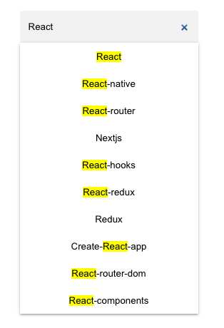

# Simple Autocomplete Component 

An Autocomplete input component built purely with React function components and hooks.

[DEMO](https://zv3-autocomplete.netlify.app) -- This demo uses the topics search [API endpoint](https://docs.github.com/en/rest/search#search-topics) from Github to populate the list of suggested options as the user types in the search input.

## Future Work

- Debounce the `keyDown` event to prevent re-rendering the list of items on every key stroke (due to highlighting). (Difficulty level: 1/5)
- Refactorings; Introduce HOCs (e.g. to control the visibility of the menu, detect outside clicks). (Difficulty level: 1/5)
- Add a small loading indicator to the right of the search input. (Difficulty level: 1/5)
- Add an up/down dropdown icon to indicate the user can re-open the dropdown menu. (Difficulty level: 2/5)
- Detect the position of the input relative to the scroll position to display the menu above or below the input. (Difficulty level: 3/5)
- Add multi-selection by displaying selected values as chips. (Difficulty level: 5/5)

## How to run -- available scripts

In the project directory, you can run:

### `npm start`

Runs the app in the development mode.\
Open [http://localhost:3000](http://localhost:3000) to view it in the browser.

The page will reload if you make edits.\
You will also see any lint errors in the console.

### `npm test`

Launches the test runner in the interactive watch mode.\
See the section about [running tests](https://facebook.github.io/create-react-app/docs/running-tests) for more information.

